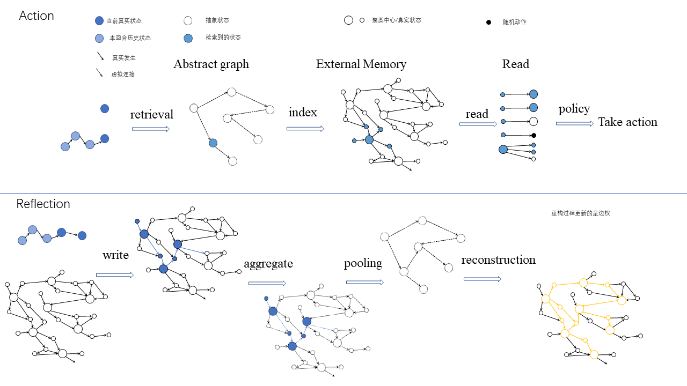
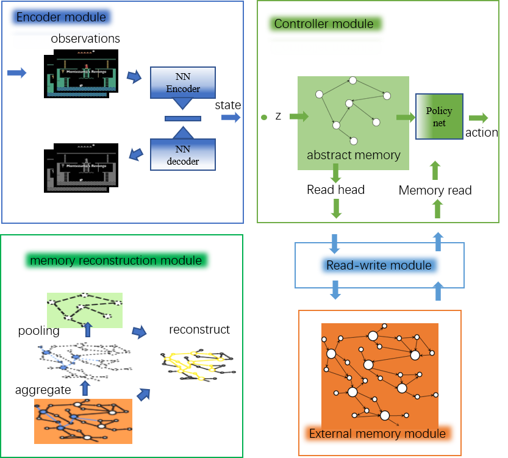

2020年5月22日
该版本的基本目的：一个基础功能的版本，希望能形成讨论交流的基础。不求所有的功能都实现，希望所有功能的接口都能流出来，为后来的测试做一个完整的框架。

代码的基本目标：验证以下运行逻辑在连续环境下可行

起点：TrainableFramework

运行入口:Base目录下运行 run.py

主要模块

## 1. 编解码模块
EncoderDecoder.py

目前使用的普通的vae,将图像输入压缩为32为特征向量。
是单独训练的。 这里除了解码图像，还解码了v值。

loss 有两个，一个是图像构造成原样，另一个是让决策的结果更接近真实的v

可能的候选方案：用Resnet 的对称结构做编解码， muzero中会有

存在问题：
+ 怎么判断编解码是否有效？只看loss吗？
+ 对v的解码是否有助于强化学习？相当于我们把每一个状态都映射到相应的v 值上，但是v值好像没用到？是不是应该把它融合到策略生成中？
+ 细节： 构造loss的时候有个kl_loss,虽然加入了，但是最后用上了吗？怎么看用没用上？
+ 每次训练用的样本就是本回合的数据，这个合理吗？
+ 一般处理视频类的算法中都会有相应的编码网络，但是他们都不是单独训练的

## 2. 存储模块

一个类，类里面有一个基本数据结构——有向特征图， 和对这个图进行读写更新用到的相关函数

存在问题：
+ 如何删除节点还没做

## 3. 控制器模块

有一个基本数据结构——抽象图，以及相应的三个功能组成。

抽象图用的是和外部存储图相同的class，是外部存储的子图，节点数量目前没有固定。
三个模块分别是：
抽象图获取功能，负责从外部存储中用GNN的方法抽象得到一个小的，具有代表性的子图；
读索引构造功能，根据当前状态，在抽象图中查找最相似的状态，查询结果将来要送到读写模块中去处理的；
策略输出功能， 根据当前状态，当前回合历史，和从外部存储中读回的记忆信息 产生输出动作。

抽象图获取功能 build abstract graph() : 先获取所有节点自身特征，以及每个节点的n跳邻居特征（如果有的话）。用aggregate的方式对他们进行加权，得到节点的一个特征；然后根据这个特征对所有节点进行一个评分，根据评分选出较高的作为抽象图中的节点，然后从原图中得到子图。

**这里的aggregator 和 pooling 都可以有参数的，如果有的话需要另外进行训练。

读索引构造功能 create read info(): 这里直接引入的是内容相似度，找到抽象图中与当前状态最相似的节点，目前只有一个，（这个操作默认我们抽象图中的节点是外部存储中周边几个相似节点的代表）

策略输出功能： 应该有三个因素决定输出，1，当前状态，2.本回合历史，3，过去的记忆。 所以要想办法把这三个融合起来，目前只用了第三个显然不合理。

存在问题：
+ 抽象图获取中的pooling是否合理？用pooling 的方法进行聚类并不合理，因为目前的特征传播不具有任何距离度量的性质，要找到一种方式能够找到局部区域内具有代表性的节点。（这里应该可以结合很多强化学习中的trick）（可不可以使用当前节点与邻居节点之间的余弦距离？在具体环境中如果可以可视化出来就好了）
+ 抽象图怎么才能做到每次只更改一部分，不对所有图进行抽象呢
+ 这里只用了一层aggregator，也就是相当于就用了一个滤波器，显然是不够的，但是够不够又由什么来评价呢？
+ 如何融合多个因素来得到输出，只做简单的采样估计是不可能有效果的。可以尝试构造网络。

## 4. 读写器模块

读：这里直接读取该节点和邻居节点的动作，有点儿太粗糙，要根据具体环境决定是否要细致一点儿。

删： coming soon!

写： 现在的做法是找到最相似的节点，然后看看相似到什么程度，如果很相似那么就用新的换掉旧的，包括连接，如果不太相似，那么就新建一个点，写入原图。

存在问题：
+ 这里一旦节点过多，写入就会很耗时，何解？
+ 读取模块还要细化

## 5. 重构机制

根据抽象图中的节点，寻找可行通路，更新通路上的值函数。

## 训练

vae 图片重构用编解码的loss ,v解码用实际的v

aggregate 用的是聚类的loss, 邻近点特征相似

## 环境

候选环境：
+ Gridmaze
+ 动态的给gridmaze
+ atari
+ vizdoom
+ pycolab
+ tvt 的环境
+ sorb 的环境
+ sptm 的环境

要能有一个基本算法可以在该环境中有一定效果，也就是要求是强化学习本身可以完成的任务