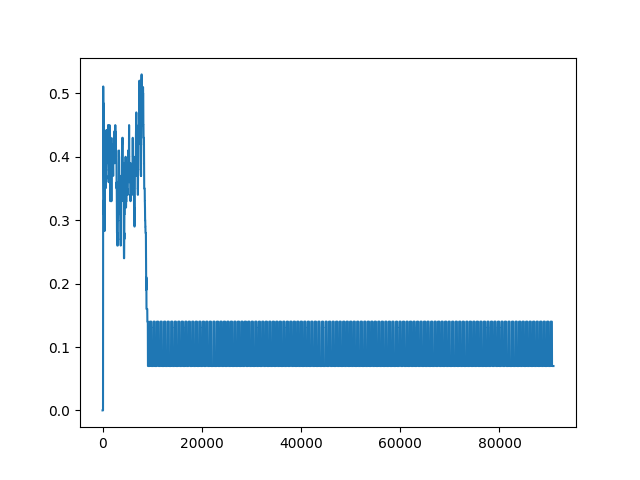

2020年5月22日
该版本的基本目的：一个基础功能的版本，希望能形成讨论交流的基础。不求所有的功能都实现，希望所有功能的接口都能流出来，为后来的测试做一个完整的框架。

代码的基本目标：验证以下运行逻辑在连续环境下可行

起点：TrainableFramework

运行入口:Base目录下运行 run.py

主要模块

## 1. 编解码模块
EncoderDecoder.py

目前使用的普通的vae,将图像输入压缩为32为特征向量。
是单独训练的。 这里除了解码图像，还解码了v值。

loss 有两个，一个是图像构造成原样，另一个是让决策的结果更接近真实的v

可能的候选方案：用Resnet 的对称结构做编解码， muzero中会有

存在问题：
+ 怎么判断编解码是否有效？只看loss吗？
+ 对v的解码是否有助于强化学习？相当于我们把每一个状态都映射到相应的v 值上，但是v值好像没用到？是不是应该把它融合到策略生成中？
+ 细节： 构造loss的时候有个kl_loss,虽然加入了，但是最后用上了吗？怎么看用没用上？
+ 每次训练用的样本就是本回合的数据，这个合理吗？
+ 一般处理视频类的算法中都会有相应的编码网络，但是他们都不是单独训练的

## 2. 存储模块

一个类，类里面有一个基本数据结构——有向特征图， 和对这个图进行读写更新用到的相关函数

存在问题：
+ 如何删除节点还没做

## 3. 控制器模块

有一个基本数据结构——抽象图，以及相应的三个功能组成。

抽象图用的是和外部存储图相同的class，是外部存储的子图，节点数量目前没有固定。
三个模块分别是：
抽象图获取功能，负责从外部存储中用GNN的方法抽象得到一个小的，具有代表性的子图；
读索引构造功能，根据当前状态，在抽象图中查找最相似的状态，查询结果将来要送到读写模块中去处理的；
策略输出功能， 根据当前状态，当前回合历史，和从外部存储中读回的记忆信息 产生输出动作。

抽象图获取功能 build abstract graph() : 先获取所有节点自身特征，以及每个节点的n跳邻居特征（如果有的话）。用aggregate的方式对他们进行加权，得到节点的一个特征；然后根据这个特征对所有节点进行一个评分，根据评分选出较高的作为抽象图中的节点，然后从原图中得到子图。

**这里的aggregator 和 pooling 都可以有参数的，如果有的话需要另外进行训练。

读索引构造功能 create read info(): 这里直接引入的是内容相似度，找到抽象图中与当前状态最相似的节点，目前只有一个，（这个操作默认我们抽象图中的节点是外部存储中周边几个相似节点的代表）

策略输出功能： 应该有三个因素决定输出，1，当前状态，2.本回合历史，3，过去的记忆。 所以要想办法把这三个融合起来，目前只用了第三个显然不合理。 (这里可以用来做对比实验，也就是我们组合不同的策略)

存在问题：
+ 抽象图获取中的pooling是否合理？用pooling 的方法进行聚类并不合理，因为目前的特征传播不具有任何距离度量的性质，要找到一种方式能够找到局部区域内具有代表性的节点。（这里应该可以结合很多强化学习中的trick）（可不可以使用当前节点与邻居节点之间的余弦距离？在具体环境中如果可以可视化出来就好了）
+ 抽象图怎么才能做到每次只更改一部分，不对所有图进行抽象呢
+ 这里只用了一层aggregator，也就是相当于就用了一个滤波器，显然是不够的，但是够不够又由什么来评价呢？
+ 如何融合多个因素来得到输出，只做简单的采样估计是不可能有效果的。可以尝试构造网络。

## 4. 读写器模块

读：这里直接读取该节点和邻居节点的动作，有点儿太粗糙，要根据具体环境决定是否要细致一点儿。

删： coming soon!

写： 现在的做法是找到最相似的节点，然后看看相似到什么程度，如果很相似那么就用新的换掉旧的，包括连接，如果不太相似，那么就新建一个点，写入原图。

存在问题：
+ 这里一旦节点过多，写入就会很耗时，何解？
+ 读取模块还要细化

## 5. 重构机制

根据抽象图中的节点，寻找可行通路，更新通路上的值函数。

## 训练

vae 图片重构用编解码的loss ,v解码用实际的v

aggregate 用的是聚类的loss, 邻近点特征相似

## 环境

候选环境：
+ Gridmaze
+ 动态的给gridmaze
+ atari
+ vizdoom
+ pycolab
+ tvt 的环境
+ sorb 的环境
+ sptm 的环境

要能有一个基本算法可以在该环境中有一定效果，也就是要求是强化学习本身可以完成的任务

## 评价方法

tvt 中完成一个简单环境的步骤大约在1e9左右，对比的方案是LSTM+ MEM。 并同时把相似内容提炼出来，这个操作如何完成？

## 先试用一下MsPacman

我们这里现在用的是atria中的，据说Deepmind 有一个专门的环境https://www.cnblogs.com/he11o-liu/p/7503246.html，先不用这个环境，但是这个环境中构造用树收索和剪枝可以完成这个任务，不过好像要认为设计一些特征。

先试一组用当前残缺记忆的，initialgraph，4000步没啥起色，但是看着有上升的趋势

先拿简单的AC实现。我们可以把观测直接映射到策略上，先省略掉中间的编码过程，回头再验证，用了编码之后的效果。两种情况中的policy net 输入不一样。
参考代码是https://blog.csdn.net/zimiao552147572/article/details/104089344
run_MsPacman_a2c.py 为入口，在controller 中构建一个网络用来执行，在agent中写一个trainning 用来训练。
这里也是用log做的，先把主体部分走通，然后再考虑学习它的用法。
另外可以仿照它做个test 部分

出现的问题：
原代码中，输入网络计算的是一个一维向量，现在的state是一个二维的tensor
为了与我们代码更好的融合，希望在网络构建部分把它改掉
a原先是2维的
a[None,:]维度就会增加

>>> import numpy
>>> a = numpy.array([1,2,3])
>>> a
array([1, 2, 3])
>>> a[None,:]
array([[1, 2, 3]])

把网络各个输入输出的维度搞清楚

values mspacman 是2维矩阵， test 是1维向量
states mspacman 是3维矩阵，test 是2维矩阵

因为我们value的维度不对，所以算出来的adv的维度是个二维的数
values= np.squeeze(values) 这个函数能够去掉维度为1的
为啥用这个维度才行？因为在做减法的时候，return - value 会自动填充维度，导致了adv 的维度不对。

编码网络没有得到训练，现在处于相互隔离的阶段

如果加入done 的判断就会让每次训练的batch 不同，如果不加入感觉那个return值算的好像还不对？

也可以画画loss 曲线做分析

从效果来看当我们把state 拿掉之后就没有随机部分了，两个解决思路: 1. 在网络参数中加入随机扰动.2.在训练数据中加入随机数

atari 游戏中都会有几个版本： 六个环境，*-v0, *-v4，*Deterministic-v0,*Deterministic-v4, * NoFrameskip-v0, *NoFrameskip-v4, 六个ram *-ram-v0,*-ram-v4

讨论ac在这里无法完成任务的原因，总是陷入局部解

看看baseline 中的a2c是怎么完成的：
最初的文章：Asynchronous Methods for Deep Reinforcement Learning
所谓的异步（asynchronous）:每个节点都有actor和自己完整的环境（包括replaymemory），还有learner用来采样、计算梯度（通常情况）。梯度是需要同步给集中的参数服务器的，参数服务器统一更新网络参数，然后周期性更新各个并行异步的环境。
采用并行的不同的actors-learners就像在探索环境的不同部分，而且，每个人都可以采用不同的探索策略，这样的话能更全方位发现策略。通过不同的线程跑不同的探索策略，众多的actor-learners同时在线更新参数就像一个单独的agent更新一样，但是我们就不在需要replay memory和experience replay。(这是重点，没有replay buffer)

论文验证了多种增强学习的算法和框架的结合，包括one-step Sarsa,one-step Q-learning, n-step Q-learning, and advantage actor-critic，我们也可以通过这些算法来理解一下框架。(我们要用advantage actor critic)

另外关于A3C算法有两点：一是在关于策略的目标函数中增加了策略的熵模型对局部收敛进行惩罚，增加了策略的探索性，具体细节可以相关论文。二是梯度更新采用RMSProp with shared statistics。

global net 只有系统，不进行训练
worker是要自己训练参数的，然后送给global net
网络结构相同

莫凡代码中有一个增加扰动的模块 env_entropy 没看懂

参考莫凡的基本原理，与keras实现https://github.com/xiaochus/Deep-Reinforcement-Learning-Practice/blob/master/AC_sparse.py

keras.optimizers 和tf.keras.optimizers 竟然不一样

2.0中的形式是
def get_updates(self, loss, params):

    grads = self.get_gradients(loss, params)

    grads_and_vars = list(zip(grads, params))

    self._assert_valid_dtypes([

        v for g, v in grads_and_vars

        if g is not None and v.dtype != dtypes.resource

    ])

    return [self.apply_gradients(grads_and_vars)]

原句是这样：actor_train = K.function([self.actor.input, actions, advantages], [], updates=actor_updates)
现在换到tf.keras中，人家说不行，【】的位置要有一个输出向量，严重怀疑actions，advantage 就是输出，但我们要找到依据。
Keras 中的function是啥？
tf.keras 中的function是啥？
keras是调用底层的，也就是说这个底层的function 是由 tf提供的，tf 能够提供什么样的东西要根据tf得到，tf里要求有一个输入，有一个输出，所以这里把输入所有的内容拿出来一部分可能是输出的部分。

接下来详细了解代码中每一步，先从ac开始，看看ac直接用到Atari视频输入中是否还会出现之前相同的情况，然后再重新考虑怎么把它弄成A3C的版本。

1 ac 几个代码的基本实现方法：

model = AC() 定义基本的模型结构
    从DRL中继承，DRL 中有 env make, play，plot,save history 函数.
    建立两个东西：初始化两个网络，一个是actor，一个是critic；以及gamma参数
        _build_actor ()
            inputs = Input(shape=(4,)) #输入维度要事先给出
            构造中间层
            用model =  Model(inputs=inputs, outputs=x) 来构造整个模型
        _build_critic()
            和actor相同的输入输出
            二者的不同用途体现在哪儿呢？
            不可以对他们用同一个class 替换吗

history model.train() 开始训练
    先对两个model分别进行compile
    actor 的loss 是自己构造的，critic没有，是直接用mse 为啥？
    在actor_loss 中，y_ture 是两个值（action，reward）， y_pred 是一个得到的一个预测的概率
    损失值是  网络预估的动作和真实动作的交叉熵，然后再乘上td error。

    critic loss 就是真实输出值和预测值的mse

    history记录episode， episode reward，actor loss和 critic loss

    用actor 输出一个概率值，为啥是[0][0]，它总共有几个维度？    
    numpy.random.choice(a, size=None, replace=True, p=None)
    从a(只要是ndarray都可以，但必须是一维的)中随机抽取数字，并组成指定大小(size)的数组，后面的p与a同等维度，每个动作的概率。这里由于是针对平衡杆只有两个动作，所以就只用两个。

    与环境交互

    target是根据reward，下一个观测， 算出来的
    先用critic 网络算预期的q是多少，如果是最后一步，就不加这个q, 否则要把q的估计值和reward相加

    得到target 算TD erro， 期望值的多少-当前值的多少

    用当前状态x 和 目标值函数，训练critic 网络

    用当前状态x 和 实际动作和tderro 作为目标，训练actor网络

model load 训练过程中或者结束时，保留了模型，要学学如何保存模型

        self.actor.save_weights('model/actor_acs.h5')
        self.critic.save_weights('model/critic_acs.h5')

model play 估计vscode 无法完成这个任务，要在mobaxterm中完成

还有个问题没有解决，刚才看到的是离散的，我们要先看一下连续动作有什么区别？
1. input 的shape 变成3了
2. 网络中用了mu, sigma 看来要把它搞成一个正太分布，然后主循环中再从正太分布中取值，得到动作。
3. 正态分布的mu,sigma直接并起来做网络输出

4. 这里的critic 和actor不同，是另外的有dense直接构造的网络，应该只是用来计算一个值，

5. 这里的discount 不再分是否为终止状态了，似乎是与环境有关
6. 给choice action 专门写了个函数，用来从分布中采样

7. 还有个小的区别，它把env 放在AC模块的构建上了

尝试给自己的代码加入相应的模块，要求能够适应所有的Atari游戏 
其实关键点就是那个输入维度的处理，以及我们是否有必要把它变成卷积的形式

基本能搞清楚ac的框架及其中使用的节点。
由于没有随机性，所以ac 算法在MsPacman 中收敛到70就不动了，12000步左右，让它再跑会儿，把结果记录下来。

看着结果是70分，但是这里由于是对每一步做1000次平均，所以结果并不是很直观。
（大家都在用a3c，但是个人感觉使用编码器似乎也可以解决这个问题）

11 再看莫凡的代码
相关度比较高，所以又出了DDPG，应用到连续环境会有更好的效果。

2 A3C的实现：

基本想法是在多个cpu上同时跑ac算法，然后再把参数回传到一个learner上，这样结果就会有多样性，而不至于陷入局部。

keras 如何同时组建多个网络，还要学一下。用多线程完成这件事。
中央大脑只负责统一和分发，所有的学习和交互都由卫星网络得到。
同样是在policy net.py中建立相应的class,然后在agent中示例化，在runner中与环境交互。

class a3c中网络结构是相同的，但是这里定义了critic_train 和actortrain 这两个在a2c的时候并没有。这里在定义的一开始就要进行初始化sess的操作，要搞清楚为啥，以及如何正确使用。

1 先把多线程的流程跑通

仍然不行，不能顺利地用tf2.0 中的keras 完成多个模型的加载，遂弃之
tf_upgrade_v2 --infile testa3c.py --outfile testa3c_1.py
仍然不能完全跨越两个版本，现在要想实现，就要想办法自己搞懂整个多线程的流程然后从头开始写。逢山开路，遇水搭桥。

不要在一棵树上吊死，如果跑不通可以试试别的代码，我们的目的要明确，是找到一个在所有Atari 游戏中通用的策略

a3c是传的梯度

几个worker 如何设计，如何通信，通信时机
tf.compat.v1.disable_eager_execution()
global net 只负责存储actor crict 参数，不训练
local net 要各自训练
目前 A3C tf2 mcpacman 可以实现，但是跑分会很低
试试多进程multi process发现并不好用，因为那个coord好像并不是用来完成这项工作的。

在git上找了一个多进程的https://github.com/fazega/snake-rl.git
这个里面的实现思路并不相同，上一个是在各个工作成员中训练，训练之后的参数回传到核心。这里好像只是在各个工作成员中跑，然后把数据拿回来的样子。具体看看。这里构造网络用的是convd, 可以尝试加到之前能用的那个版本中，看看能不能有效果。 怎么把三维的变成2维的，或者就没变？

2 把输入改了，让它适应更多的游戏

3 在mspacman中做对比

ps: 如果我们用onehot形式作为actor的输出，那么我们就应该尝试用其它形式的loss

    