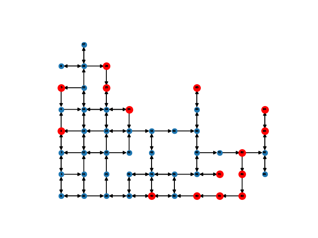
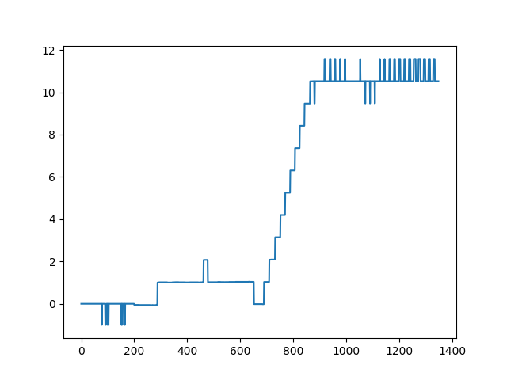
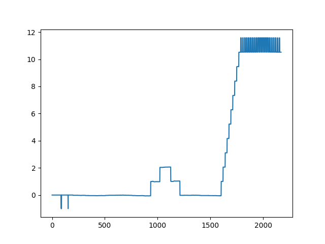

# 目的
展示所有实验的细节：
+ 构造的图到底长成什么样？
+ GNN传播了什么信息？
+ 抽象图是否具有实际意义？
+ 重构的路径是否会出现之前没有出现的路径？
+ 对实验效果有提升的细节有哪些？
# 基本步骤
+ 尝试原先的框架进行重构，让整体思路更加顺畅
+ 先用迷宫格作为输入，状态就是它的坐标，上面的问题都能够解答之后再用其它环境，至少保证论文中有可以写的内容
+ 之前对比的是Qlearning，可以尝试对比DQN ,DQN+PER, MODEL BASED
# 代码记录

## 0805

+ 环境maze
+ 用q_learning 先试一下 mainq.py, 结果存在 RESULT/Q中， 参数设置中有200步的上限， 40个回合左右可以收敛
+ 换成图结构的Q mainGQ.py, GMRAgent.py 中的Canopy 是一个.py 文件，不是一个库
+ Graph.nodes Graph.edges 都不加s 了好像是版本问题，重装之后可用
+ 之前的结果可复现

## 0806

+ 对main GC进行重构，同时可视化每个步骤，
    + 每一步的构图是什么？
    + 在图中找到的聚类中心是什么？
    + 重构了哪些轨迹？
    + 是否有新的轨迹出现？这个由于轨迹太多所以目前看不出来哪条是没走过的，后期可以尝试把图形调小，然后可以少跑几次循环，这样就能看到新的轨迹了
+ 改用 GNN的方式进行抽象
    + 入口 GNN_Detail.py
    + 智能体主体： GNNAgent.py (和原先的GMRagent.py区分)
    + 按照现在能跑通的模块进行更改，仅仅把抽象部分换成GNN，并加入训练模块，其它先不动
    + 查询的过程也直接从外部查，先不经历模糊检索那一步
    + 其实就是替代掉由dataset 产生cluster 的过程，但是这个过程要进行训练，可以先不进行训练，加和平均，只用前向部分,build abstract graph
    + 有一点儿疑惑的是aggregate 的前向使用和反向训练怎么感觉并不在一个class中完成，回头要看这种机制是否合理？？？
    + len(G.neighbors(curr_node)) 竟然不被允许,要用list
    + self_vec 的维度并不太合适，要搞一个通用的
    + 现在所有的聚类中心都是后面的点，因为我们选点方法不对，尝试调节它
    + 尝试把中心点的特征值减下去, 这样得到的聚类点都在边缘或者只有一个输出的，这些点周围的点求平均与它们自身相差比较大，但并不是我们想要的
    
    
    + 我们可以找到那种求平均和自身相差不太多的点，这些点会比较有代表性。用的是两跳邻居，16个
    + 目前来看它很难有一个稳定的收敛点，可能是因为探索过程稳定了，但聚类中心还在不断跳动，选的时候是在最低的（基本上会有0）那些点中随机选，所以并不稳定，尝试增加聚类中心的个数，以覆盖那些随机挑选。
    + 基本可以得到一个稳定的效果
    
    这里是两次实验的结果
    
    + 现在的aggregate仍然是不可训练的，面临的问题是，如果想让他能够训练起来，那么我们要找到相应的训练目标，比如相邻节点更相似。怎么评价相似度呢？
        + 差值？ 也就是说，一个节点和邻居的差异越小越好，这种节点更能代表周边这片小区域。邻居之间的差异性是不是也可以考虑进来
        + cosine距离？把特征看成是一个向量，那么两个向量的cosine 距离越接近1，二者的夹角越小。

    + 所以我们给aggregate 函数的输入要是差值，而不是原函数
        + feature 中为啥会有0？
        [[245. 285. 275. 315.]
         [  0.   0.   0.   0.]
        [245. 285. 275. 315.]
        [245. 285. 275. 315.]]
        因为 feature matrix 最开始都是零，我们设定的是如果它的邻居是自己，那么我们就pass,这时相应的位置就是0 了。那么我们能当初为啥不用自己呢？
        + 直接在self_vec中加入newaxis，然后直接减就行。
        + 这样剪完做输入和直接输入再做减法的区别在于，我可以之后直接做训练，相当于提前做了一步特征处理
    + 另外一个要思考的问题是加入R的评估
    + 先把训练的方案移植过来

    
    + 现在的问题是我们的pooling 过程似乎并不能完成聚类效果，我们要不要在这个基础上加入聚类算法？
    + 尝试把pooling 换成聚类
    + 然后尝试对agg的参数进行训练
    + 目前只有一个聚类中心，需要进一步调试
    + 这个聚类应该是要迭代的呀，怎么只有一次呢？如果只有一次岂不是随机选取的中心点了？这个算法只是用来初步确立中心个数的，并不能很好的表示聚类
    + 一个后续的改进，对图直接聚类Graph Community Detection：
    https://zhuanlan.zhihu.com/p/62027503
    

CUDA_VISIBLE_DEVICES=0,2,3 

+ some tricks
    + 50的环境
    + v值进行传播*****
    + loss 如何构建 

    + 确定不是死胡同，并且在探索边界（最远或着最少的位置）
    + 目标点和当前点的距离

+ 检索部分没做，也就是前向索引没有做

+ 两个基本框架进行合并，重构，希望能够适应更多的游戏，包括数据结构的融合

