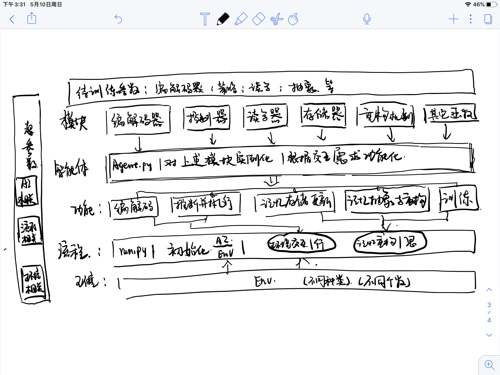

# 图记忆重构

基本框架的重新梳理，目标： 参数可训练的agent。
根据当前代码结构和相关参考码完成一个基础版本，为实验部署做准备。

# 代码现有结构

有六个基本模块：编解码器，控制器，读写器，存储器，重构机制，其它函数。要求它们本身是完整的模块类，尽量减少互相之间的调用。

在agent 中对每个用到的模块进行实例化，通过实例化的模块形成特定的功能函数，这些功能函数的有机结合形成智能体。

在env文件夹中构造不同的环境及相应的封装函数。

环境和智能体在run.py中进行交互。包括了超参数的引入，环境和智能体的初始化，（行）环境交互，（思）记忆重构，（悟）参数训练。

# 实现步骤：

1. 先把框架搭建起来；
2. 逐一缕清每一个模块；
3. 把存在的问题记录下来，重点标出；
4. 把相关参考代码找到，进行对比；
5. 重构每一个模块，要求是能够进行参数训练；
6. 得到一个可行的版本，准备部署实验。

# 代码笔记

## 1. 先搭建框架

三个基本内容：

环境+ 交互 + 智能体

### 1.1 环境

./envs/tpycolab/tenv.py

具体的环境构建是在key_to_door.py中，这里的pycolab 是一种通用的构建方法，我们可以尝试自己根据自己的需求来构建环境.

我们的目标是找到一个能够验证图结构方法适用的环境。

### 1.2 智能体

包含两个部分，一个是init 部分，对各个用到的模块进行实例化；
另外一部分是功能函数的构建，根据我们实际交互的需求，用实例化之后的模块构建相应的功能；
供交互过程调用。

### 1.3 交互流程

+ 环境和智能体初始化
+ 与环境交互
+ 记忆重构
+ 参数训练

## 2. 几个模块的梳理

### 2.1 编解码模块

EncoderDecoder.py 中构建基本模块，包含编解码器的基本结构和输出组件。
目前使用的是VAE by keras。 三层Dense 结构，这里是将原始图像先拉成一个长向量，然后再进行编码，loss 的构建用的是重构误差。

编解码器需要和存储器中节点特征维度相统一。三层参数（输入，编码，隐含层），learning_rate 是一个超参数，
epochs 和 batch size 需要根据实验环境进行重新调整

存在问题：
1. 没有解码状态值函数v; 参考tvt中的构造方法，同时要知道这个值decode出来之后怎么用的。应该是代码中的baseline的值，后来用来构造tvt_reward， tvt_reward.py中可以看到它的用法。在控制器的policy 中定义，用了隐含层200个节点的MLP. 需要进一步思考的是如果我们把所有的v值都融合到节点属性了，那么这个值函数的预测是否还有意义，或者说我们在图结构中写入的值函数是否有必要是这个值函数。
训练： 每个observation 会对应一个state， 每个state又会对应一个估计的\hat{v}, 而在实际的与环境交互过程中，根据本回合得到的奖励能够计算出来每个状态真实的v, 二者做差形成一个v_loss。
问题： 两个loss 如何同时进行训练？加在一起是最简单的方式，能不能有其它方案？https://www.it1352.com/833692.html
https://keras.io/zh/models/model/ 看来得好好学学了
https://keras.io/guides/functional_api/#use-the-same-graph-of-layers-to-define-multiple-models
这里还有疑问：tvt中用stop gradient. 还有另外一种用途就是图中会根据连接关系重构出来一个v,
2. 应该还有其它的编解码方法，参考TVT，worldmodel，muzero等；
 + TVt中用卷积的方式进行编码，有待实现，先放放。。
3. 另外一种编码是用ResNet直接做在图像上；
4. 要搞清楚怎么将不同地方的网络联合到一起初始化和训练；
    + 这个是目前要关注的，看看读写模块中是否有必要加入训练，没有的话，直接构造抽象部分的参数，并考虑如何进行训练
5. 可以考虑事先对编码器进行训练，然后再拿出来推断；
    + 后话，先不考虑

### 2.2 控制器模块

控制器模块

动态维护一个抽象图，作为控制器

init部分：
重新实例化一个memory的子图，作为抽象图

组件：
1. 从原始图中抽象图， build abstract graph.
    + 得到节点和邻域的特征
    + 然后对邻域和自己进行加权求和，权重是可训练的，这个权重的维度与邻域个数有关，可以有多层的封装aggregate1作为备选
    首先解决参数的引入和训练问题，在graphsage中用的是分别构造网络结构的方法，估计他的目的是加入一个中间是否引入contact的选项，而我们不需要这个，可以尝试直接使用dense来完成.那么如何去训练呢？正向用是对每个节点用邻居做聚合，得到下一层特征，那么反过来训练的时候我们要有一个结果来对这些参数进行反向传播，先假如我们能够得到标签，看看应该会窜到什么地方？？？models.py对模型进行了构建，先确定这一部分是否用到，再回头看怎么用的，然后尝试搬到我们自己的代码中

    相当于encoder中的前向模型构造完成了，下来要给他初始化一下，不需要关注前向模型后来用法，只要得到输出，然后和标签对比（没有标签就想其它办法）构造loss,然后加入数据进行训练，另外一个问题就是数据如何加入？用什么地方的数据

    训练和前向使用肯定不能用同一个函数，所以要重新构造一个,先放在控制器核心中

    接下来的问题怎么构造标签，或者loss ,还得学习

    + 得到每个节点的新特征，把他转换成评分，乘上权重，这个权重是与节点个数相关的，所以如果没有固定记忆大小，它是不可用的
    + 取评分前KN个作为代表节点构成子图
2. 根据当前状态，和轨迹，从抽象图中得到记忆索引 create read info，推理的重要部分
    + 根据内容相似度检索到最相似的那一个
3. 从记忆中读回推理并实施 policy net
    + 直接从一堆候选动作中采样一个，是不是有点儿太粗糙了

存在问题：
1. 待完成功能，根据当前状态生长树，并根据实际执行情况，不断地进行树剪枝
2. 还是要依赖于Memory,utils两个模块的
3. 邻域加权的权重是可训练的，那么我们要用什么去训练呢
4. pooling的权重是与整个图的大小相关的，但是我们的图是一个动态图
5. 想清楚为啥用前kN个节点有啥依据吗？这个output看作我们在sagpool中的z,取k个作为中心节点，按照什么原则取？如果跟邻域长得越像，那么我们得到的乘积会越大，前提是我们归一化所有向量，因为邻域的内积相当于向量夹角，可是我们并没有做内积呀
6. 多层aggregate 的用法，多层和一次多个节点的区别是我们能够训练不同的核参数
7. 现在在aggregate过程中，先把所有的都算了，但是实际上我们可以选择每次只计算episode的个数那么多
8. 这里用的是mean aggregator , 可以参考Graphsage构造其它类

9. 这里不能只检索一个，可以尝试根据轨迹推测一些，或者可以把LSTM机制引入进来作为辅助，那样就会多一套训练机制

### 2.3 存储器模块
不仅仅是外部存储，我们的控制器核心同样是从这个类实例化得到

一张可读可写的图；
这里的所有操作只针对图完成，与智能体无关；

存在问题：
1. 这里的update edge是固定的Q规则，希望能够通过函数调用的方式实现多种规则，也就是另写一个函数完成，在这里作为接口接入。
2. 这里的node_feature_list 经常用到，但是每次都重新读一遍，很麻烦
    nx.from_ dict_ of_ lists(graph) 还有这种函数可用：adj = nx.adjacency_matrix(nx.from_dict_of_lists(graph))
3. 目前没有限制节点个数，也就是没有遗忘机制

### 2.4 读写器模块

读出，遗忘，写入
参考tvt/memory.py 相似度度量参考dnc中access.py的调用逻辑

读出：
+ 根据当前的索引状态在外部存储器中读取相应的节点，并输出节点的动作

遗忘
+ 没有完成

写入
+ 先找到写入的位置
+ 然后将原向量和当前向量按比例混合

存在问题：
1. 目前遗忘部分还没有构造
2. get location 有一部分是和memory中的addpair重复的样子
3. 读写本来是有参数的，但是这里没加，主要是没搞清楚参数加入的含义如何解释

### 2.5 重构机制 

根据当前的抽象图，重构原图中的连接

存在 问题：
1. 这个一定很耗时，因为每两个节点之间就要做一次
2. 其实这里隐含了一个最短路，这会降低算法的通用性

### 2.6 其它
utils.py
一些各个模块可能都用得到的函数，比如相似度度量，onehot 编码等

1. 相似度度量：度量的是编码内容的相似度，本来是一个batch一起算，这里只算了一个

## 未归类问题

+ 如何鼓励探索？我们不能总按老路走，应该以一定的几率探索新路径，放在动作执行的函数中，根据老路的置信度来决定是否进行新的探索。

